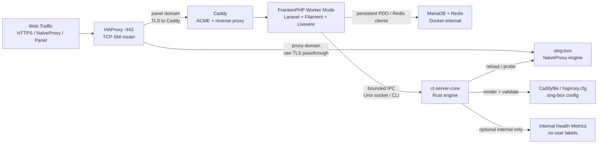

# Cool Tunnel Server / Panel

[](./LICENSE)
[](./LTSC-HENG-LICENSE-DRAFT.md)
[](https://github.com/coo1white/cool-tunnel-server/releases)
[](https://github.com/coo1white/cool-tunnel-server/actions/workflows/ci.yml)
[](https://github.com/coo1white/cool-tunnel-server/actions/workflows/audit.yml)

Cool Tunnel Server is the VPS-side control plane and proxy ballast for
[Cool Tunnel](https://github.com/coo1white/cool-tunnel). It is built for
a 1 vCPU / 1 GB RAM Debian host and treats low memory as a hard design
constraint, not an afterthought.

This repository is not a hosted VPN business. It is a self-operated
server stack: FilamentPHP for management, FrankenPHP worker-mode for the
application runtime, Rust for deterministic core operations, and Docker
for reproducible orchestration.

Read [Disclaimer.md](./Disclaimer.md) before deployment. You are
responsible for local law, provider terms, and the traffic you route.

## System Contract

| Constraint | Position |
| --- | --- |
| Minimum host | Debian 11/12/13, root SSH, 1 vCPU, 1 GB RAM, ports `80/tcp` and `443/tcp`. |
| Current baseline | `v0.0.89`. Wire format is WireV1; subscription manifests are stable across the 0.0.6x–0.0.8x line. |
| Runtime model | FrankenPHP worker-mode with Laravel Octane. Laravel boot cost is paid once per worker. |
| Core model | `ct-server-core` Rust binary owns rendering, probes, drift checks, the credential-lock invariant, and a Rule Maker daemon FSM with bounded `BytesMut` frames, typed wire errors, and OTel-style network-turn spans. |
| Data posture | Zero user tracking. Internal health metrics are allowed; user data collection is forbidden. |
| Deployment posture | Idempotent shell bootstrap, Docker Compose, pinned manifests, Makefile gates. |
| License posture | Active license: AGPL-3.0-only. Restrictive LTSC-Heng terms are drafted in [LTSC-HENG-LICENSE-DRAFT.md](./LTSC-HENG-LICENSE-DRAFT.md). |

## Architecture Deep-Dive



FrankenPHP worker-mode keeps the Laravel application resident. The panel
does not cold-boot the framework on every request, and database/Redis
clients are reused through the worker lifetime where the framework and
driver allow it. This reduces request latency, allocator churn, and CPU
spikes during Filament/Livewire interaction.

The Rust core is the deterministic layer. PHP owns operator workflow and
UI state; Rust owns bounded parsing, config rendering, probe execution,
daemon IPC, and drift-sensitive checks. The design goal is zero-copy in
the operational sense: keep data in typed structures, avoid lossy shell
string pipelines, pass only the minimum frame over IPC, and write final
configuration artifacts atomically.

Daemon connections traverse a connection-local finite state machine — the
Rule Maker. Transitions are atomic compare-exchange and the table is the
only code allowed to choose a successor; an event whose required
predecessor does not match forces `HardReset`. Oversized frames, read
timeouts, malformed UTF-8, and malformed JSON are connection-scoped hard
resets. Valid requests whose domain operation fails still return through
`Responding` as a typed wire error. After every successful turn the
server enters `ProbingConstancy`, measures frame and latency pressure
against an 80% bottleneck threshold, and narrows the next read chunk
under load without raising the hard frame cap. See
[docs/daemon-fsm.md](./docs/daemon-fsm.md) and
[docs/observability-dashboard.md](./docs/observability-dashboard.md).

The stack is intentionally split:

| Layer | Implementation | Duty |
| --- | --- | --- |
| Management UI | Laravel 11, Filament 3, Livewire, Blade | Accounts, panel settings, subscription URLs, operator controls. |
| Application runtime | FrankenPHP + Octane worker-mode | Low boot overhead, long-lived workers, bounded recycle via `MAX_REQUESTS=500`. |
| Engine core | Rust workspace under `core/` | Rendering, probes, component checks, reload decisions, typed IPC. |
| Orchestration | Docker Compose, Makefile, shell scripts | Hardening, rebuilds, health checks, backups, release discipline. |

## First Deploy

This walks you from "I just bought a VPS" to "my proxy works" in
about 20 minutes. **No prior Docker / Laravel / Rust experience
needed** — just type the commands as written and answer the
prompts you'll see along the way. Most of the wait is the build
running on its own.

### What you need before starting

Three things must be ready BEFORE you run any command. Skip none
of them — the install will fail in confusing ways otherwise.

#### 1. A Linux VPS

You need a server running **Debian 11, 12, or 13**. Any provider
works (RackNerd, Hetzner, Vultr, DigitalOcean, Linode, AWS Lightsail
— pick one).

Minimum specs:
- 1 CPU, 1 GB RAM
- Ports `80` and `443` open to the internet (most providers do this
  by default; AWS / GCP / Azure require an explicit firewall rule)
- A public IPv4 address (your provider shows this in the dashboard
  after creation — looks like `203.0.113.42`)

Cost is typically `$3–$5 / month` at the lower end.

#### 2. Two domain names pointing at your VPS

You don't need to register two separate domains. Two **subdomains**
of one domain you already own work fine. In this guide we'll use:

- `proxy.example.com` — where the proxy itself runs
- `panel.proxy.example.com` — where the admin website runs

Replace `example.com` with your own domain throughout.

In your DNS provider's control panel (Cloudflare, Namecheap, your
registrar's panel — same idea everywhere), create **two A records**:

```
Type: A   Name: proxy           Value: 203.0.113.42  (your VPS IP)
Type: A   Name: panel.proxy     Value: 203.0.113.42  (same VPS IP)
```

> ⚠️ **Cloudflare users**: click the orange-cloud icon next to each
> record so it turns grey ("DNS only"). The proxy needs a direct
> TCP connection — Cloudflare's CDN will break it.

#### 3. An email address for SSL renewal alerts

Let's Encrypt sends a reminder email a few weeks before each cert
expires. Use any email you check — `you@gmail.com` is fine.

### Check your DNS works

Before installing anything, confirm DNS from your **laptop**, not
the VPS. Open a terminal on your laptop and run:

```bash
dig +short A proxy.example.com
dig +short A panel.proxy.example.com
```

✅ **Good**: both print your VPS IP (`203.0.113.42` in the example).

❌ **Bad**: either prints nothing, or a different IP, or an error.
  - **Wait 5–15 minutes** if you just created the records (DNS
    takes a moment to propagate worldwide).
  - **Double-check the records** in your DNS provider — typos in
    the IP or hostname are the #1 cause.
  - **Don't continue** until both lookups return your VPS IP.
    Installing with broken DNS will burn Let's Encrypt rate-limit
    budget on failed cert requests.

### Step 1 — SSH into the VPS and run the bootstrap

SSH to your VPS as `root` (or run `sudo -i` to become root). Then
copy-paste this single line:

```bash
curl -fsSL https://raw.githubusercontent.com/coo1white/cool-tunnel-server/main/scripts/bootstrap.sh | bash
```

This downloads the project, installs Docker if it's not already
there, and prepares a config file. **Takes about 1 minute.**

When it finishes you'll see something like:

```
✓ scaffolded /opt/cool-tunnel-server/.env

  Next:
    1. cd /opt/cool-tunnel-server
    2. $EDITOR .env     # set DOMAIN, PANEL_DOMAIN, ACME_EMAIL
    3. make install
```

Follow those three lines — the next two steps cover (1)+(2) and (3).

### Step 2 — Edit the config file

```bash
cd /opt/cool-tunnel-server
nano .env
```

> If `nano` isn't installed, run `apt install -y nano` first.
> `vim` works too if you prefer.

You'll see lots of lines. **Find these three** (they're near the
top) and set them to YOUR values:

| Line you'll see  | Set it to (your value)              | Concrete example                     |
|------------------|-------------------------------------|--------------------------------------|
| `DOMAIN=`        | Your **proxy** subdomain            | `DOMAIN=proxy.example.com`           |
| `PANEL_DOMAIN=`  | Your **admin website** subdomain    | `PANEL_DOMAIN=panel.proxy.example.com` |
| `ACME_EMAIL=`    | Your email for SSL alerts           | `ACME_EMAIL=ops@example.com`         |

> ⚠️ **Don't change anything else.** `APP_KEY`, `DB_PASSWORD`,
> `REDIS_PASSWORD`, `CT_CLASH_SECRET_SEED` etc. were already filled
> in with strong random values by the bootstrap. Touching them will
> break things.

Save and exit (`Ctrl+O`, `Enter`, then `Ctrl+X` in nano).

### Step 3 — Build and start everything

```bash
make install
```

This is the slow step — **plan on 10–15 minutes** on a 1 CPU VPS.
It builds 4 Docker images, runs database migrations, gets SSL
certificates from Let's Encrypt, and starts every service.

You'll see a lot of output scrolling by. The important thing to
watch for at the end:

✅ **Good**: `✓ Update complete.` printed near the end.

❌ **Bad**, with a recovery hint for each common case:

| What you see | What it means | What to do |
|---|---|---|
| `acme: error: ... unauthorized` | Let's Encrypt couldn't reach your VPS on port 80 | Wait 10 minutes for DNS, check your firewall allows port 80, then re-run `make install` |
| `panel: ✗ permission denied` on `.env` | Bootstrap left `.env` world-readable | Run `chmod 0600 .env` then re-run `make install` |
| `failed to solve: ... 404` | An upstream package was renamed | This is rare; pull the latest version with `git pull && make install` |
| Hangs forever on a build step | 1 CPU is slow | Be patient — the panel image's `apk add` step alone takes ~5 minutes on the smallest VPS |

### Step 4 — Verify the install worked

Run these three commands one after another:

```bash
make status
make components
make readiness
```

What each one tells you:

- **`make status`** — quick "are the containers up?" check. You
  should see `ct-panel`, `ct-db`, `ct-redis`, `ct-caddy`,
  `ct-haproxy`, `ct-singbox` all `Up`.
- **`make components`** — 12-row table of every dependency. Every
  row should say `OK` in green.
- **`make readiness`** — the launch gate. You're aiming for
  `9/10 PASS` on the first run. The one NG should be check 10
  ("Set `LNC_TEST_PROXY_URL=...`") — that's normal; we'll fix it
  in Step 6 once you have a real user.

✅ **Good**: `make readiness` ends with
`Result: PASS — ready to ship.`

❌ **Bad**: jump to the [recovery table](#fixing-common-problems)
in the Maintaining section below. The most common first-deploy
failure is check 3 (`ACME cert issued by ...`) being NG, which
means Caddy hasn't gotten certificates yet — usually a DNS or
port-80 issue.

### Step 5 — Create your first admin user

This is the user you'll log in as on the admin website.

```bash
docker compose exec -T panel php artisan ct:make-admin
```

The command will ask you three things one at a time:

```
Email:    > you@example.com           ← your login email
Password: > something-strong          ← write this down
Name:     > Your Name                 ← anything; shows on screen
```

> 💡 **Pick a strong password** — at least 16 random characters.
> You can generate one with `openssl rand -base64 16` if you don't
> have a password manager.

When that finishes, open `https://panel.proxy.example.com/admin`
in your browser and log in with the email + password you just set.

In the Filament admin UI:
1. Click **"Proxy Accounts"** in the left sidebar.
2. Click **"New Proxy Account"** (top right).
3. Pick a username (e.g. `me`) and a password for the proxy user.
4. Click **"Create"**.

🎉 Your proxy server is now live and you have one user.

### Step 6 — Confirm the proxy actually works (the 10/10 check)

This is the optional last step that gives you `10/10` on the
readiness gate. Replace `me` below with the proxy username you
just created in Step 5:

```bash
USERNAME=me
URL=$(docker compose exec -T -e PROBE_USER="$USERNAME" panel \
  php artisan tinker --execute '
    $a = \App\Models\ProxyAccount::where("username", getenv("PROBE_USER"))->firstOrFail();
    $d = \App\Models\ServerConfig::current()->domain;
    echo "https://{$a->username}:{$a->getCleartextPassword()}@{$d}:443";
  ')
LNC_TEST_PROXY_URL="$URL" make readiness
unset URL LNC_TEST_PROXY_URL
history -d $((HISTCMD-1)) 2>/dev/null
```

✅ **Good**: `10/10 (100%) — Result: PASS — ready to ship.` with
check 10 reading `[OK] 10. hide_ip + hide_via effective`.

That confirms the entire path works end-to-end: HAProxy is
routing TLS, sing-box is accepting your credentials, and the
proxy is correctly hiding the upstream's identity.

### Optional — make commands easier from any directory

After SSHing back in later, you'll usually start in `/root`, not
the install directory. Add this once to your shell config so
`ct update`, `ct readiness`, etc. work from anywhere:

```bash
cat >> ~/.bashrc <<'EOF'
# Cool Tunnel Server convenience
ct() { (cd /opt/cool-tunnel-server && make "$@"); }
alias ctsh="cd /opt/cool-tunnel-server"
EOF
source ~/.bashrc
```

Then `ct readiness`, `ct status`, `ct backup`, `ct update` all
work without remembering to `cd` first. `ctsh` jumps you into the
install directory if you want to edit files.

### Quick path (advanced — for experienced operators)

If you've done this before and don't need the hand-holding, the
whole bootstrap + edit + install can collapse into one command:

```bash
DOMAIN=proxy.example.com \
PANEL_DOMAIN=panel.proxy.example.com \
ACME_EMAIL=ops@example.com \
AUTO_INSTALL=1 \
curl -fsSL https://raw.githubusercontent.com/coo1white/cool-tunnel-server/main/scripts/bootstrap.sh | bash
```

This is also the right form for Ansible / Terraform / cloud-init.
You still need to do Step 5 (create admin) and Step 6 (10/10
probe) afterwards.

## Maintaining a Running Deployment

What to do once the install works. Each section below is a
"recipe" — copy-paste the commands and read what they do.

> 💡 The examples assume you've added the shell alias from First
> Deploy's last step. If you haven't, just `cd /opt/cool-tunnel-server`
> first and use `make ...` instead of `ct ...`.

### Updating to the latest version

The single most common operation. Run this whenever a new release
is announced (every few days during active development):

```bash
ct backup     # always FIRST — protects you if the update goes wrong
ct update     # pull + rebuild + restart — takes 1–10 minutes
ct readiness  # confirm everything still works
```

What `ct update` does, in plain terms:

1. **Locks** so no one else can run an update at the same time.
2. **Pulls** the latest code from GitHub.
3. **Auto-fixes** old config files if they're out of date.
4. **Rebuilds** the Docker images (fast on second run thanks to
   caching).
5. **Restarts** the panel and applies any database changes.
6. **Re-renders** the proxy config and reloads it.
7. **Verifies** every dependency still matches what's expected.

✅ **Good**: ends with `✓ Update complete.` and `make readiness`
returns 9/10 PASS afterward.

❌ **Bad**: see the [recovery table](#fixing-common-problems)
below.

### Backing up your data

```bash
ct backup
```

This creates `backups/cool-tunnel-<timestamp>.tar.gz` with
**everything** needed to restore on a fresh server: the database,
your config (`.env` with all secrets), and the SSL certificates.

> ⚠️ The backup tarball **contains every password on your VPS**.
> Treat it like a secret — `chmod 0600` is set automatically, but
> you should also **copy it off-server** to somewhere encrypted
> (Backblaze B2, an encrypted USB drive, etc.) so a fire / VPS
> termination doesn't take both your live data and the backup.

A simple "copy off-server" recipe from your laptop:

```bash
scp root@your-vps:/opt/cool-tunnel-server/backups/cool-tunnel-*.tar.gz \
    ~/backups/cool-tunnel/
```

### Restoring from backup

If your VPS dies and you need to bring up a new one:

1. Provision a fresh VPS the same way you did the first time.
2. Run `make install` to bring up an empty stack (Steps 1–4 of
   First Deploy).
3. Copy your backup tarball back to the new VPS:
   ```bash
   scp ~/backups/cool-tunnel/cool-tunnel-LATEST.tar.gz \
       root@new-vps:/opt/cool-tunnel-server/backups/
   ```
4. Restore:
   ```bash
   cd /opt/cool-tunnel-server
   ./scripts/restore.sh backups/cool-tunnel-LATEST.tar.gz
   ct readiness
   ```

You're back online, with the same accounts, same passwords, same
SSL certs.

### Looking at logs when something seems off

```bash
# Quick "what happened in the last few minutes" view
docker compose -f /opt/cool-tunnel-server/docker-compose.yml logs --tail=60 panel

# Same, but follow live (Ctrl+C to stop)
docker compose -f /opt/cool-tunnel-server/docker-compose.yml logs -f panel

# Just the errors, no info noise
docker compose -f /opt/cool-tunnel-server/docker-compose.yml logs --tail=200 panel \
  | grep -iE 'error|fatal|critical|warn'
```

Replace `panel` with `singbox`, `caddy`, `haproxy`, `db`, or
`redis` to look at a different service.

### Rotating passwords (every 90 days is a good cadence)

> ⚠️ **Read this whole section before running anything.** Done
> wrong, the panel can't connect to its database and goes down.
> Done right, you have new secrets and ~30 seconds of downtime.

```bash
ct backup    # ALWAYS first
```

Then for `REDIS_PASSWORD` (safest to rotate first; lowest blast
radius):

```bash
cd /opt/cool-tunnel-server
NEW=$(openssl rand -base64 32)
awk -v p="$NEW" '/^REDIS_PASSWORD=/ { print "REDIS_PASSWORD=" p; next } { print }' \
  .env > .env.tmp && mv .env.tmp .env && chmod 0600 .env
docker compose up -d --force-recreate redis panel
unset NEW; history -d $((HISTCMD-1)) 2>/dev/null
sleep 15 && ct readiness   # should be 9/10 PASS
```

For `DB_PASSWORD` and `DB_ROOT_PASSWORD`, the order matters — you
have to update the database first, then `.env`, then restart:

```bash
cd /opt/cool-tunnel-server
NEW_DB=$(openssl rand -base64 32)
NEW_ROOT=$(openssl rand -base64 32)

# 1) Tell MariaDB about the new passwords (uses OLD root password from .env)
docker compose exec -T -e MYSQL_PWD="$(grep '^DB_ROOT_PASSWORD=' .env | cut -d= -f2-)" db \
  mariadb -u root -e "
    ALTER USER 'cooltunnel'@'%' IDENTIFIED BY '$NEW_DB';
    SET PASSWORD FOR 'root'@'%' = PASSWORD('$NEW_ROOT');
    SET PASSWORD FOR 'root'@'localhost' = PASSWORD('$NEW_ROOT');
    FLUSH PRIVILEGES;
  "

# 2) Update .env with the new values
awk -v db="$NEW_DB" -v dbroot="$NEW_ROOT" \
  '/^DB_PASSWORD=/      { print "DB_PASSWORD=" db; next }
   /^DB_ROOT_PASSWORD=/ { print "DB_ROOT_PASSWORD=" dbroot; next }
   { print }' \
  .env > .env.tmp && mv .env.tmp .env && chmod 0600 .env

# 3) Restart panel so it picks up the new DB_PASSWORD
docker compose up -d --force-recreate panel

# 4) Wipe new values from shell + verify
unset NEW_DB NEW_ROOT; history -d $((HISTCMD-1)) 2>/dev/null
sleep 15 && ct readiness && ct components
```

> 🚫 **Never rotate `APP_KEY`.** It encrypts every proxy account's
> stored cleartext password — rotating it makes them all
> unreadable, and every user's subscription URL stops working.
> Treat `APP_KEY` as permanent for the lifetime of this deployment.

### Watching health over time (optional)

The Rust daemon can expose Prometheus-format metrics. Off by
default. To turn on:

1. Edit `.env`, uncomment / add: `CT_METRICS_BIND=127.0.0.1:9292`
2. `ct update` (or just `docker compose restart panel`)
3. From inside the panel container:
   ```bash
   docker compose exec -T panel curl -fsS http://127.0.0.1:9292/metrics
   ```

Three counters worth alarming on if you wire this to Grafana /
Alertmanager:

- `ct_threshold_80pct_crossings_total` — daemon got close to a
  resource limit (frame buffer, latency budget). Investigate
  client behaviour.
- `ct_daemon_fsm_hard_resets_total` — daemon rejected a malformed
  protocol message. Non-zero rate usually means a misbehaving
  client.
- `otel_network_turn_latency_milliseconds` — daemon-side latency
  distribution.

Full Prometheus scrape config + Grafana queries in
[docs/observability-dashboard.md](./docs/observability-dashboard.md).

### Fixing common problems

If something goes wrong, check this table first — most issues
have a one-command fix:

| What you're seeing | What it means | What to do |
|---|---|---|
| `ct update` died part-way (SSH dropped, disk full, etc.) | Build was interrupted but state is fine | Just re-run `ct update` — it's safe to repeat |
| `Build fails with curl: (22) error 404` | A package upstream got renamed | `ct update` again later, or `git pull` for the latest fix |
| `credential-lock` reports `NG` | DB password and rendered config disagree | Run `ct update` again; if it persists, the rotation playbook above probably wasn't run cleanly — restore the latest backup |
| Panel container restarts in a loop | Usually empty `APP_KEY` or wrong `OCTANE_SERVER` | `docker compose logs --tail=80 panel` will show the exact line; both have a clear stderr message starting with `[frankenphp-worker]` |
| `make readiness` shows check 8 NG with `Redis URL did not parse` | You rotated `REDIS_PASSWORD` to a value with `/`, `+`, or `=` on a pre-v0.0.88 install | Either upgrade to v0.0.88+ (`ct update`) or rotate `REDIS_PASSWORD` to a hex value (`openssl rand -hex 32`) |
| `make readiness` shows check 8 NG with `no daemon ack within 3s window` | Almost always panel just restarted and the daemon is still booting | Wait 30 seconds and re-run `ct readiness` |
| Filament login page returns "419 PAGE EXPIRED" on every form submit | Pre-v0.0.68 `.env` issue with `APP_URL` | `ct update` — fixed automatically by the auto-migration |
| Browser shows "ERR_SSL_PROTOCOL_ERROR" or cert warnings | Certificate hasn't been issued / has expired | `docker compose logs caddy \| tail -40` will show the ACME error; usually DNS or port-80 reachability |
| Panel shows component drift (e.g. `mariadb` reports VersionMismatch) | The pinned version was bumped in code | `ct update` to bring everything in lockstep |

For anything not covered here, [`docs/operator-runbook.md`](./docs/operator-runbook.md)
has more detailed troubleshooting.

### Advanced — what `ct update` actually does internally

For operators who want to understand the steps `ct update` runs,
here's the full sequence:

1. Acquires an exclusive `flock` so a second operator can't race
   the update (v0.0.80 hardening).
2. `git pull --ff-only` to the latest tag on `main`.
3. Auto-migrates legacy `.env` shape (PANEL_DOMAIN placement,
   APP_URL hostname) if needed; idempotent on already-canonical
   files.
4. Rebuilds the Rust core + panel + sing-box + HAProxy images.
   Subsequent runs hit the BuildKit cache and finish in seconds.
5. Brings the new panel image up and waits for the entrypoint
   sentinel.
6. Runs Laravel migrations (no-op if nothing pending).
7. Re-renders sing-box config; asserts `ct-server-core guard
   credential-lock` (`db = rendered = manifest = mac-config`) —
   refuses to proceed on drift, without printing passwords.
8. Restarts sing-box for a clean state purge (v0.0.73).
9. SIGHUPs HAProxy for a graceful re-exec.
10. Runs the strict component check on the post-swap runtime.

If anything fails mid-update, the `flock` auto-releases on script
exit and the whole script is idempotent — just re-run `ct update`.

## Industrial Makefile

The Makefile is an operator surface, not decoration. Targets fail early
when required tools, manifests, runtime state, or binary alignment are
wrong. This is the **First Scold** rule: the system rejects an invalid
environment before it mutates production state.

| Command | Role |
| --- | --- |
| `make help` | Enumerate the available operator and developer targets. |
| `make build` | Build the Rust workspace in release mode with offline SQLx metadata. |
| `make deploy` | Alias of `make update`; pull, rebuild, migrate, render, verify, and reload. |
| `make update` | Main production update path. |
| `make audit` | Full local audit gate, equivalent to `make ci`. |
| `make ci` | Rust fmt/clippy/test, PHP syntax, Composer audit, shellcheck, manifest checks, SoT parity, supervisord invariants. |
| `make status` | Docker state, image state, embedded core binary presence, recent panel/sing-box errors, certificate presence. |
| `make components` | Run `ct-server-core component check` against pinned manifests. |
| `make readiness` | Execute `scripts/late-night-comeback.sh`, the 10-check operator launch gate (PASS at `9/10`; structural failures cap the score below the threshold). |
| `make verify-sot-vps` | Validate panel-hostname single-source-of-truth from inside the running Docker stack. |
| `make backup` | Snapshot database, `.env`, and Caddy ACME state. |
| `make sbom` | Generate CycloneDX SBOMs for Cargo, Composer, and Docker surfaces. |

`make update` also runs `ct-server-core guard credential-lock` between
the sing-box render and the post-purge component check. The guard
asserts `db = rendered = manifest = mac-config` for every active proxy
account and fails NG without printing passwords. Operators can invoke
it directly:

```bash
docker compose exec -T panel ct-server-core guard credential-lock
```

Developer gates:

```bash
make fmt
make lint
make test
make php-test
make shellcheck
make manifest-lockstep
```

Production operators should run:

```bash
cd /opt/cool-tunnel-server
make status
make components
make readiness
```

## QA Checklist: Operator's Eyes

### Worker Mode Stability Under Load

- [ ] Confirm FrankenPHP is the active panel runtime:
  `docker compose exec -T panel supervisorctl status frankenphp`.
- [ ] Confirm worker recycle guard is present:
  `docker compose exec -T panel sh -lc 'grep -R "MAX_REQUESTS=500" /etc/supervisor* /etc/supervisord.conf 2>/dev/null || true'`.
- [ ] Drive concurrent panel requests from the VPS or a trusted host:
  `for i in $(seq 1 200); do curl -sk https://panel.proxy.example.com/up >/dev/null & done; wait`.
- [ ] During the run, watch memory and restart behavior:
  `docker stats ct-panel ct-db ct-redis ct-singbox ct-haproxy ct-caddy`.
- [ ] Expected: no panel restart loop, no unbounded memory climb, `/up`
  remains HTTP 200, and `make status` reports no recent fatal panel
  errors.

### Filament UI Responsiveness During Config Changes

- [ ] Open `https://panel.proxy.example.com/admin`.
- [ ] Create, disable, and re-enable a proxy account from Filament.
- [ ] Change an anti-tracking toggle or cover-site setting.
- [ ] In parallel, tail the internal workers:
  `docker compose logs -f --tail=80 panel sing-box haproxy`.
- [ ] Expected: Filament remains responsive, Livewire actions complete,
  the Rust renderer emits deterministic config updates, and sing-box
  reloads without a full-stack restart.

### Docker-Internal Health Metrics Visibility

- [ ] Keep public ports limited to `80/tcp` and `443/tcp`:
  `sudo ss -ltnp`.
- [ ] Confirm no metrics port is host-published:
  `docker compose ps` and `docker inspect ct-panel`.
- [ ] `CT_METRICS_BIND` is opt-in (default empty). The recommended
  single-container value is `127.0.0.1:9292` — bind only inside the
  panel container or loopback namespace, never on a public interface.
- [ ] Scrape from inside the trusted Docker boundary only:
  `docker compose exec -T panel sh -lc 'curl -fsS http://127.0.0.1:9292/metrics || true'`.
- [ ] Expected: internal-health counters only. No usernames, account
  IDs, target hosts, subscription tokens, request IDs, or per-user
  destination data. Network-turn timings appear under
  `otel_network_turn_*` and `ct_threshold_80pct_crossings_total`;
  daemon protocol faults appear under `ct_daemon_fsm_hard_resets_total`.
  The Prometheus scrape config, alert rules, and Grafana panel
  queries live in
  [docs/observability-dashboard.md](./docs/observability-dashboard.md).

## Observability Boundary

Allowed:

- Container health, restart count, memory, CPU, and process limits.
- DB pool pressure, semaphore saturation, reload coalescer counters.
- Component drift checks and version pin verification.
- Synthetic anti-tracking probes initiated by the operator.

Forbidden:

- Per-user destination logs.
- Device identifiers.
- Subscription token logging.
- Request correlation IDs that identify a user.
- Metrics labels such as `username`, `account_id`, `target_host`, or
  equivalent identifiers.

Internal health metrics are an operator safety surface. User data
collection is a posture violation.

## Smoke Tests

Run from `/opt/cool-tunnel-server`:

```bash
docker compose ps
make status
make components
make readiness
```

Verify public routing:

```bash
sudo ss -ltnp | grep ':443'
nc -vz proxy.example.com 443
nc -vz panel.proxy.example.com 443
```

Verify proxy behavior with a real account:

```bash
docker compose exec -T panel sh -lc '
URL=$(php artisan tinker --execute '\''$a = \App\Models\ProxyAccount::where("username", "alice")->firstOrFail(); $d = \App\Models\ServerConfig::current()->domain; echo "https://{$a->username}:{$a->getCleartextPassword()}@{$d}:443";'\'')
ct-server-core probe anti-tracking --via "$URL"
'
```

Expected: JSON with `"reachable":true`.

## Services

| Service | Job |
| --- | --- |
| `haproxy` | Public `:443` TCP SNI router. No TLS termination. |
| `sing-box` | NaiveProxy server for the proxy domain. |
| `caddy` | ACME, certificate renewal, panel-domain reverse proxy. |
| `panel` | FrankenPHP worker-mode Laravel/Filament runtime plus Rust core binary. |
| `db` | MariaDB for configuration and account state. |
| `redis` | Cache, queue, and revocation bus. |

## Project Map

| Path | Purpose |
| --- | --- |
| [docker-compose.yml](./docker-compose.yml) | Production topology, hardening, memory limits, internal networks. |
| [.env.example](./.env.example) | Operator configuration surface. |
| [docker/panel/](./docker/panel/) | FrankenPHP, supervisord, PHP hardening, panel image. |
| [panel/app/Filament/](./panel/app/Filament/) | Filament admin UI. |
| [core/ct-server-core/src/](./core/ct-server-core/src/) | Rust control engine. |
| [core/ct-server-core/src/daemon_fsm.rs](./core/ct-server-core/src/daemon_fsm.rs) | Rule Maker connection FSM, atomic transition table, Heng constancy probe. |
| [core/ct-server-core/src/observability.rs](./core/ct-server-core/src/observability.rs) | OTel-compatible network-turn spans, capped hex dumps, 80% threshold helpers. |
| [core/ct-protocol/src/](./core/ct-protocol/src/) | Shared protocol and manifest structures. |
| [sing-box/config.json.tpl](./sing-box/config.json.tpl) | Proxy engine template. |
| [caddy/Caddyfile.tpl](./caddy/Caddyfile.tpl) | Public Caddy template rendered by the panel/core. |
| [haproxy/haproxy.cfg.tpl](./haproxy/haproxy.cfg.tpl) | Public SNI routing template. |
| [manifests/](./manifests/) | Version pins and component verification rules. |
| [manifests/credential-lock.upstream.json](./manifests/credential-lock.upstream.json) | `db = rendered = manifest = mac-config` invariant for `ct-server-core guard credential-lock`. |
| [scripts/](./scripts/) | Bootstrap, install, update, backup, probes, stress gates. |
| [scripts/late-night-comeback.sh](./scripts/late-night-comeback.sh) | The 10-check operator readiness gate (DNS, ports, ACME, UFW, kernel, NTP, components, Redis bridge, cover invariant, anti-tracking probe). |

## License

The active repository license is **AGPL-3.0-only**. See [LICENSE](./LICENSE).

The LTSC-Heng restrictive license is currently a draft for legal review:
[LTSC-HENG-LICENSE-DRAFT.md](./LTSC-HENG-LICENSE-DRAFT.md).

The draft states the intended stricter posture:

- Software is provided **AS IS**.
- Commercial reselling, white-labeling, paid appliance distribution, or
  managed resale requires Sovereign Endorsement.
- Network-operated modifications must remain source-available in the
  AGPL-3.0 spirit.
- 2026 milestone markers, audit markers, and LTSC provenance comments
  must be retained unless the related behavior is removed and documented.
- User tracking expansion is prohibited.

Bundled upstream components retain their own licenses. See [NOTICE](./NOTICE)
and [THIRD_PARTY_LICENSES.md](./THIRD_PARTY_LICENSES.md).

## Operator References

| Document | Use |
| --- | --- |
| [GETTING_STARTED.md](./GETTING_STARTED.md) | Beginner install path. |
| [docs/installation-debian.md](./docs/installation-debian.md) | Step-by-step Debian 10/11/12/13 install for first-time operators. |
| [docs/operator-runbook.md](./docs/operator-runbook.md) | Update, repair, and incident commands. |
| [docs/architecture.md](./docs/architecture.md) | Deeper system design notes. |
| [docs/components.md](./docs/components.md) | The OK/NG component model and the eleven pinned components. |
| [docs/daemon-fsm.md](./docs/daemon-fsm.md) | Rule Maker text diagram, no-forking rule, Heng constancy logic. |
| [docs/observability-dashboard.md](./docs/observability-dashboard.md) | Prometheus scrape config, alert rules, Grafana panels for `/metrics`. |
| [docs/release-stress-test.md](./docs/release-stress-test.md) | Runtime gate (`scripts/stress/run-all.sh`) for tagging a release. |
| [docs/architectural-decisions-2026.md](./docs/architectural-decisions-2026.md) | Closing record of the 2026 self-audit programme. |
| [docs/cross-platform-clients.md](./docs/cross-platform-clients.md) | Client family roadmap (macOS today, iOS/Android/Windows/Linux planned). |
| [docs/going-to-china.md](./docs/going-to-china.md) | GFW-resistance operator runbook. |
| [docs/ai-unit-test-generation.md](./docs/ai-unit-test-generation.md) | Retrieval anchors and contract-first guidance for AI maintainers. |
| [LTSC.md](./LTSC.md) | Long-term servicing commitments and 2026 milestones. |
| [AUDIT.md](./AUDIT.md) | Audit cycle map and release gates. |
| [SECURITY.md](./SECURITY.md) | Security model and reporting path. |
| [CONTRIBUTING.md](./CONTRIBUTING.md) | Contributor rules and code posture. |

<sub>Jurisdiction: Wyoming, USA. Steward: coolwhite LLC.</sub>
