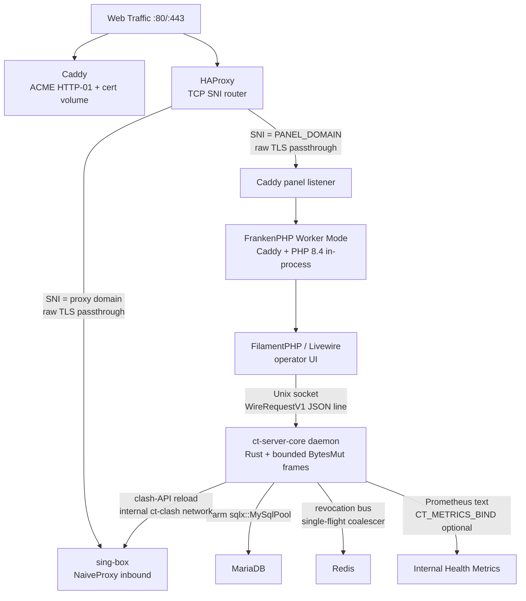

# Cool Tunnel Server

> **Deterministic control plane for a self-hosted NaiveProxy edge.**
>
> Target floor: **1 vCPU / 1 GB RAM**. Runtime:
> **FilamentPHP/Livewire -> FrankenPHP Worker Mode -> Rust core daemon**.
> Posture: **zero user tracking**; operator-internal health metrics only.

[](./LICENSE)
[](https://github.com/coo1white/cool-tunnel-server/releases)
[](https://github.com/coo1white/cool-tunnel-server/actions/workflows/ci.yml)
[](https://github.com/coo1white/cool-tunnel-server/actions/workflows/audit.yml)

> **Read this first.** Cool Tunnel Server is operator-side software
> for circumventing network censorship. Read the
> [Disclaimer](./Disclaimer.md) before deploying, particularly if
> you are outside the United States or operating it for someone who is.

It is the backend for the [Cool Tunnel macOS client](https://github.com/coo1white/cool-tunnel). Once you stand it up, your client speaks to your server; everything in between looks like ordinary HTTPS to anyone observing the network. The web admin panel manages accounts, quotas, the cover site that probes see, and live operator surfaces.

---

## Operating Contract

Cool Tunnel Server is not a hosted service. It is infrastructure
software. You run it on a VPS you control; your users' access policy,
credentials, quota state, and operational logs remain under your
administrative boundary.

| Constraint | Repository decision |
|---|---|
| **1 GB RAM VPS floor** | Service memory caps are explicit in `docker-compose.yml`; the default panel shape is four FrankenPHP workers plus queue, scheduler, and Rust daemon. Low-memory builds use `CT_CORE_BUILD_PROFILE=release-small`. |
| **Worker-mode PHP** | FrankenPHP keeps Laravel, Filament, Livewire, and OPcache hot inside long-lived workers; `MAX_REQUESTS=500` bounds worker drift. |
| **Rust engine core** | `ct-server-core` runs as a supervised daemon with a warm `sqlx::MySqlPool`, bounded Unix-socket frame readers, and typed daemon responses. |
| **Zero user tracking** | No per-destination logs, no per-user analytics labels, no subscription-token access logs. User-identifying data does not enter the Prometheus surface. |
| **Internal health metrics** | Optional `CT_METRICS_BIND` exposes docker-internal Prometheus metrics for daemon pressure, latency, buffer utilization, and FSM hard resets. This is operational telemetry, not user data collection. |

---

## License Contract

This software ships under the **GNU Affero General Public License v3, no-or-later qualifier (AGPL-3.0-only)**. Copyright © 2026 coolwhite LLC.

| You may | You must |
|---|---|
| Use, study, modify, redistribute the source | Preserve the licence and source-availability |
| Run private modifications without disclosure | (no obligation while strictly private) |
| Operate a modified version as a network service | Publish those modifications under AGPL-3.0 (§ 13 — the SaaS clause) |
| Charge for hosting, support, deployment | The covenant constrains the *code*, not your operations |

The covenant is the source-availability guarantee for every networked
modification.

License history (forward-only): `v0.0.58–v0.0.60` shipped under AGPL-3.0-or-later; `v0.0.61–v0.0.62` shipped under PolyForm Noncommercial 1.0.0 (the "Self-Protective" era); `v0.0.63` onward returns to AGPL, this time pinned to `-only` under coolwhite LLC stewardship. Each prior tag remains available under the licence it shipped with.

A proposed restrictive commercial covenant is drafted in
[`LTSC-HENG-LICENSE-DRAFT.md`](./LTSC-HENG-LICENSE-DRAFT.md). It is
not the active repository license unless the steward explicitly adopts
it by replacing `LICENSE` and publishing a release under those terms.
This avoids silently misrepresenting AGPL-3.0-only permissions.

---

## Heng Discipline

The project ships on constancy, not velocity.

| What we ship on | What we do not ship on |
|---|---|
| Reproducibility regressions | Marketing dates |
| Audit-cycle findings (40+ codified checks) | Influencer roadmaps |
| Operator-reported defects (round-N reviews) | Feature-velocity targets |
| Upstream protocol drift | Unsourced roadmap expansion |

The audit suite is the line we hold:

| Check | Cadence |
|---|---|
| `cargo audit` (RustSec) | weekly + every PR touching Cargo |
| `cargo deny` (license + ban + source) | weekly + every PR touching Cargo |
| `composer audit` (PHP CVEs) | weekly + every PR touching `composer.lock` |
| Manifest drift (`manifests/` ↔ `Cargo.toml` ↔ Dockerfiles) | weekly + every PR |
| Anti-tracking config smell-test | weekly + every PR |
| Stale-doc grep | weekly |
| `phpstan --level=5` + Laravel Pint + PSR-4 strict | weekly + every PR touching `panel/app/**` |
| `sqlx` offline metadata staleness | weekly + every PR |
| Tag ↔ panel-config version-sync gate | every `v*` tag push |
| Secret scan (gitleaks) | weekly |

A release ships only when this matrix is green and the tag-level
version gate accepts the release.

---

## 2026 Milestones

Seven cross-cutting policies the codebase will not silently retreat
from. Each one is enforced by compile-time discipline, an audit
cycle, or a structural type-system invariant — not by code-review
attention alone. Every operator deploying this stack inherits these
guarantees.

| Milestone | Enforcement mechanism | Codified |
|---|---|---|
| **Immutable Ballast** — long rationale comments encoding incident provenance are load-bearing; deletion requires tracing the referenced version through `CHANGELOG.md`. | Code-review rule + the `//` and `//!` blocks above every threshold and decision in source. | v0.0.62 |
| **Zero `unwrap()` floor** — every fallible operation has a typed error path; production-failure-as-panic cannot land. | Workspace clippy lints (`unwrap_used`, `expect_used`, `panic`, `todo`, `unimplemented` → `deny`); `unsafe_code = "deny"` adjacent. | v0.0.10 / codified v0.0.62 |
| **Zero blocking-syscall floor** — async path is structurally clean; `std::sync::MutexGuard`'s `!Send` is the compile-time tripwire against `.await`-while-held. | Source sweep (zero `std::fs::*`, `std::process::Command`, `std::thread::sleep` outside test code) + `std::sync::Mutex` guard semantics. | v0.0.65 |
| **Zero leak (bounded-spawn) posture** — every `tokio::spawn` site declares a cardinality bound; daemon-accept semaphore + Coalescer single-flight handle-check are the structural tripwires. | Per-spawn semaphore / handle-check / per-process singleton. New spawn sites must declare their bound in source. | v0.0.65 |
| **Internal-health vs user analytics** — operator-internal metrics endpoint is opt-in and bound to docker-internal addresses; per-user analytics surface remains a deliberate no-op. | LTSC carve-out + `internal_metrics.rs` design (counters hand-enumerated; per-user labels structurally impossible to slip in without a visible module edit). | v0.0.67 |
| **Bounded frame discipline** — network-boundary reads must use capped buffers and deterministic timeout/error paths. | `bytes::BytesMut` frame readers in `core/ct-server-core/src/frame.rs`; daemon and internal metrics endpoint share the bounded primitives. | v0.0.69 |
| **No-forking daemon FSM** — every daemon turn has a single authoritative state transition path; deviations hard-reset the connection. | `daemon_fsm.rs` uses atomic compare-exchange transitions; invalid predecessor observations move to `HardReset`, not a second branch of truth. | v0.0.69 |

Full text and rationale: [`LTSC.md § 2026 milestones`](./LTSC.md).
Current baseline as of this README: server **`v0.0.70`**, macOS
client **`v2.0.26+`** (separate repo,
[`coo1white/cool-tunnel`](https://github.com/coo1white/cool-tunnel)).

---

## Protocol is Truth

| Property | Mechanism |
|---|---|
| Cover-site invariant | Every public URL on your domain returns the SAME bytes as your chosen "fake website"; probes cannot distinguish a valid endpoint from a random path. Verified end-to-end on every release. |
| TLS 1.3 only, browser-shaped handshake | The handshake itself does not fingerprint the box as a proxy. |
| No engine-fingerprint headers | `Server: Caddy` stripped; `X-Powered-By` disabled. No wire response says "Caddy", "PHP", "FrankenPHP", or "Cool Tunnel". |
| No per-connection logs | sing-box logs at `warn` only; subscription HMAC tokens never persist on disk. |
| DoH for the proxy's own DNS | Your ISP cannot observe what you resolve. |
| Three-network Docker isolation | The `ct-data` and `ct-clash` networks isolate database and management plane respectively. |
| Hot reloads in <100 ms | Add or disable accounts and the proxy picks it up without a daemon restart, without dropped connections. |

You toggle the panel-side anti-tracking flags in **Server config**. Verified by an active probe on every release.

---

## What you get

- NaiveProxy on `:443` with TLS 1.3 and browser-shaped handshake.
- Public cover-site invariant: probes get the configured cover bytes,
  not framework errors or project-identifying headers.
- Multi-user account control with expiry, byte quotas, and one-time
  cleartext password display.
- Hot reload from panel save to sing-box without daemon restart.
- FrankenPHP Worker Mode for the Filament panel; Laravel boot is paid
  once per worker, not once per request.
- Rust daemon for config rendering, clash-API reloads, component
  checks, Redis revocation coalescing, and internal health metrics.
- Three-network Docker isolation: public edge, data plane, and
  management plane do not collapse into one bridge.
- One-command bootstrap with numbered pre-flight checks and explicit
  recovery hints on failure.

---

## Prerequisites

- A small Linux VPS — Debian 11/12/13 recommended. **1 vCPU / 1 GB RAM is enough for a few users.**
- A domain you control (a subdomain works); A-record pointing at the VPS public IP.
- Ports `22` (SSH), `80` (Let's Encrypt), `443/tcp` (proxy) open at the cloud firewall.
- Basic comfort with `ssh` / `git` / a config-file editor. **No PHP or Rust knowledge required** — Docker handles it.

---

## Quick start

On a fresh Debian/Ubuntu VPS as `root`. Pick whichever install pattern matches your trust model.

### The One-Click Bastion

```bash
curl -fsSL https://raw.githubusercontent.com/coo1white/cool-tunnel-server/main/scripts/bootstrap.sh | bash
```

The bootstrap is idempotent. Re-running it does not destroy an
existing `.env`; it installs Docker CE and Compose v2 when absent,
fast-forwards `/opt/cool-tunnel-server` when already cloned, generates
strong DB/Redis/admin secrets when the template still contains
placeholders, and leaves the operator at the explicit
`./scripts/install.sh` pre-flight gate.

Unattended bootstrap is available for Terraform, Ansible, or a
cloud-init bastion:

```bash
DOMAIN=proxy.example.com \
ACME_EMAIL=ops@example.com \
AUTO_INSTALL=1 \
curl -fsSL https://raw.githubusercontent.com/coo1white/cool-tunnel-server/main/scripts/bootstrap.sh | bash
```

`AUTO_INSTALL=1` chains into `install.sh` only when `DOMAIN` is set.
The install path handles Docker state freshness, `.env` mode
hardening, DNS and TCP/80 ACME reachability, low-memory Rust build
profile selection, binary alignment through manifests, and final
component verification.

### Verify, then Run

For operators who consider supply-chain integrity part of their threat model:

```bash
curl -fsSLO https://raw.githubusercontent.com/coo1white/cool-tunnel-server/main/scripts/bootstrap.sh
less bootstrap.sh                # read it
sha256sum bootstrap.sh           # cross-check against the SHA on the GitHub release page
bash bootstrap.sh
```

### Manual Three-Step

```bash
apt update && apt install -y git curl jq dnsutils apache2-utils \
    docker-ce docker-ce-cli containerd.io \
    docker-buildx-plugin docker-compose-plugin
git clone https://github.com/coo1white/cool-tunnel-server.git /opt/cool-tunnel-server
cd /opt/cool-tunnel-server && cp .env.example .env && $EDITOR .env
./scripts/install.sh
```

After bootstrap (any pattern):

```bash
cd /opt/cool-tunnel-server
$EDITOR .env                     # set DOMAIN, PANEL_DOMAIN, ACME_EMAIL,
                                 # DB_PASSWORD, DB_ROOT_PASSWORD, REDIS_PASSWORD
./scripts/install.sh             # 8 numbered steps; ↳ try: hints on every failure
```

Panel at `https://panel.<your-domain>/admin`. First boot: 1–3 minutes.

> **Deploying for use from inside the Great Firewall of China?** Read [`docs/going-to-china.md`](./docs/going-to-china.md) end-to-end before you travel.

---

## What's running

| Container | Job |
| --- | --- |
| **`panel`** | Laravel 11 + Filament 3 admin. FrankenPHP + Octane worker mode. |
| **`haproxy`** | TCP-mode SNI router on `:443`. Sniffs the SNI without decrypting; forwards raw bytes — apex SNI → sing-box, panel-subdomain SNI → caddy. |
| **`sing-box`** | The proxy. Speaks NaiveProxy. Reads the config the panel renders for it. |
| **`caddy`** | ACME provider. Hands the cert to sing-box via shared volume. Reverse-proxies the panel subdomain. |
| **`db`** | MariaDB 11. Accounts, settings, traffic counters. |
| **`redis`** | Cache + the bus that pushes "this account was just disabled" to sing-box within ~100 ms. |

---

## System architecture



**FrankenPHP Worker Mode.** The panel does not pay Laravel and
Filament boot cost on every request. FrankenPHP loads
`public/frankenphp-worker.php` once per worker and reuses the booted
application across requests. `MAX_REQUESTS=500` bounds long-lived
worker drift; the Caddyfile currently runs four workers to stay inside
the 1 GB VPS floor. Octane's database-disconnect hook is disabled, so
the worker process keeps its DB handle warm instead of reauthenticating
on every panel turn.

**Rust core daemon.** `ct-server-core daemon` is supervised inside the
panel container and owns the operations that must be deterministic:
atomic config rendering, clash-API reloads, Redis revocation
coalescing, component checks, bounded frame parsing, and optional
Prometheus metrics. The daemon constructs one `sqlx::MySqlPool`
at startup and shares it across socket handlers and the Redis
subscriber. Pool clones are reference bumps, not new connection storms.

**Zero-copy philosophy.** The PHP/Rust IPC contract is JSON-line over a
Unix socket, not a large shared-memory transport. Inside the Rust
boundary, network reads accumulate into `bytes::BytesMut` with hard
caps and split/freeze semantics; malformed or oversized frames reset
the connection, not the process. The practical objective is to avoid
unbounded partial-frame growth and avoid cloning packet/control-plane
buffers during forwarding and metrics parsing.

Deeper walkthrough: [`docs/architecture.md`](./docs/architecture.md).

---

## Makefile Operator Surface

The Makefile is the local command contract. Its targets are thin
wrappers around scripts and CI gates; the scripts perform the strict
pre-flight checks before mutating state. This is the "first scold":
fail before build, before ACME wait, before schema migration, and
before a half-deployed edge can accept traffic.

| Command | Contract |
|---|---|
| `make help` | Lists every target with its one-line contract. |
| `make install` | Runs `scripts/install.sh`; first-time bootstrap with `.env` permission checks, Docker checks, DNS/ACME checks, image build, migrations, render, cert wait, and component check. |
| `make update` | Fast-forward pull, legacy `.env` auto-migration, rebuild, migrate, re-render, reload, component check, then sing-box reload. |
| `make deploy` | Alias of `make update`; deploys the latest fast-forwarded release path. |
| `make status` | One-shot operator view: containers, images, Rust binary presence, recent panel/sing-box errors, and cert presence. |
| `make readiness` | Runs `scripts/late-night-comeback.sh`, the operator readiness gate. |
| `make components` | Runs `ct-server-core component check --manifests /srv/manifests` inside the panel container. |
| `make ci` | Mirrors GitHub CI: Rust fmt/build/test/clippy, PHP syntax and composer audit, shellcheck, manifest parse, SoT parity, supervisord lifecycle drift. |
| `make audit` | Alias of `make ci`; local pre-PR audit gate. |
| `make build` | Alias of `make rust-build`; local Rust release build gate. |
| `make rust-build` | Release Rust workspace build with `SQLX_OFFLINE=true` and locked dependencies. |
| `make rust-test` | Release Rust workspace tests with offline sqlx metadata. |
| `make rust-clippy` | Clippy under workspace deny rules for `unwrap`, `expect`, `panic`, `todo`, `unimplemented`, and unsafe-code posture. |
| `make sqlx-prepare` | Regenerates `core/.sqlx/` after migrations or query changes. |
| `make sbom` | Emits CycloneDX SBOMs for cargo, composer, and Docker surfaces. |
| `make set-version V=X.Y.Z` | Bumps Cargo workspace, lockfile, manifests, and panel version in lockstep before tagging. |

The GitHub `audit.yml` workflow remains the scheduled and path-scoped
security audit. `make audit` is the local gate an operator can run
before opening a PR or tagging a release.

---

## QA Checklist — Operator's Eyes

### Layer 1 — operator-side
- [ ] `docker compose ps` shows all six services `Up` and `healthy`.
- [ ] `LNC_TEST_PROXY_URL='https://alice:<pw>@<domain>:443' ./scripts/late-night-comeback.sh` returns ≥ 9 / 11.
- [ ] `docker compose exec panel ct-server-core component check --manifests /srv/manifests` shows 11 × OK.

### Layer 2 — PHP / FrankenPHP boundary
- [ ] `https://panel.<domain>/admin` loads, valid TLS, login page renders.
- [ ] First admin can log in.
- [ ] Five failed logins lock you out with a generic message (round-25 invariant).
- [ ] `ct:make-admin --force` recovery path works.
- [ ] Worker-mode health remains stable under load:

  ```bash
  docker compose exec panel curl -fsS http://127.0.0.1:9000/up
  for i in $(seq 1 100); do
      curl -fsS -o /dev/null http://127.0.0.1:9000/up &
  done
  wait
  docker compose logs --tail=120 panel | grep -Ei 'fatal|panic|worker|exception' || true
  ```

- [ ] Worker recycling is bounded: `docker compose exec panel grep -n 'MAX_REQUESTS=500' /etc/supervisord.conf`
      confirms the supervised FrankenPHP program recycles workers at
      the documented ceiling.

### Layer 3 — Filament UI → Rust subprocess
- [ ] Create a proxy account; cleartext password shown ONCE.
- [ ] Subscription URL action prints `https://panel.<domain>/api/v1/subscription/<base64-token>`.
- [ ] Server config save triggers `caddy reload` within ~5 s (`docker compose logs --tail=20 panel`).
- [ ] Activating a different cover site flips the previously-active one to inactive (round-27 invariant).
- [ ] Components page renders all 11 components, none `NG`.
- [ ] During repeated Server config saves, a second browser tab on
      Proxy Accounts remains responsive and Livewire actions do not
      return `419` or `5xx`.
- [ ] `docker compose logs --tail=120 panel` shows daemon reloads
      and no `daemon FSM hard reset` under ordinary operator actions.

### Layer 4 — end-to-end proxy traffic
- [ ] NaiveProxy client connects with `naive+https://<user>:<pw>@<domain>:443`. A real website loads.
- [ ] Cover-site invariant: `curl -sI https://<domain>/api/v1/subscription/garbage-token` returns the same `Content-Type` + `ETag` as `curl -sI https://<domain>/random-path`.
- [ ] Traffic counter increments after a few MB; `Used` bytes grow on the proxy account row.
- [ ] Set `Quota bytes = 1`; account flips to disabled within 60 minutes; client stops connecting.

### Layer 5 — Docker-internal health metrics
- [ ] Enable metrics explicitly in `.env` or daemon flags:
      `CT_METRICS_BIND=127.0.0.1:9292`.
- [ ] Restart the panel container and scrape from inside the panel
      namespace:

  ```bash
  docker compose up -d panel
  docker compose exec panel curl -fsS http://127.0.0.1:9292/metrics | head
  ```

- [ ] Confirm health-only series are visible:
      `otel_network_turns_total`,
      `otel_network_turn_latency_milliseconds`,
      `ct_buffer_utilization_high_water_basis_points`,
      `ct_threshold_80pct_crossings_total`, and
      `ct_daemon_fsm_hard_resets_total`.
- [ ] Confirm forbidden labels are absent:
      no `username=`, `account_id=`, `target_host=`, `token=`, or
      `request_id=` appears in `/metrics`.

---

## Common operations

```bash
# Live logs
docker compose logs -f --tail=20 panel
docker compose logs -f --tail=20 sing-box

# Update to latest release
git fetch --tags && git checkout main && git pull --ff-only
./scripts/update.sh

# Backup (db + .env + Caddy ACME state)
./scripts/backup.sh

# Restore onto a fresh box
./scripts/restore.sh backups/cool-tunnel-2026-05-08T05-00-00Z.tar.gz

# Pre-launch readiness gate (11-point checklist)
./scripts/late-night-comeback.sh

# Reset a forgotten admin password (round-25 recovery path)
docker compose exec panel php artisan ct:make-admin --force \
    --email=you@example.com --password=newpassword

# Full local CI gate
make ci

# Optional: scrape the operator-internal-health /metrics endpoint
# (opt-in via CT_METRICS_BIND in .env; default OFF — see LTSC.md
# § Internal-health observability vs user analytics for the
# scope and posture). Once set, e.g. CT_METRICS_BIND=127.0.0.1:9292:
docker compose exec panel curl -s http://127.0.0.1:9292/metrics
```

The `/metrics` endpoint exposes only operator-internal-health
counters and gauges: semaphore saturation, DB-pool utilization,
network-turn latency, bounded-buffer pressure, FSM hard resets,
Redis subscriber restarts, Coalescer fire rate, and process uptime.
It carries **zero per-user data, ever**. A metric that identifies a
user, account, target host, token, or request is forbidden by policy
and belongs nowhere in the Prometheus surface.

---

## Repo layout

```
cool-tunnel-server/
├── panel/              Laravel 11 + Filament 3 admin (PHP 8.4)
├── core/               Rust workspace
│   ├── ct-protocol/    Shared protocol and component-manifest types
│   └── ct-server-core/ Server daemon + CLI used by the panel
├── sing-box/           sing-box config template
├── caddy/              Caddyfile template
├── haproxy/            haproxy.cfg template (SNI router)
├── docker/             Per-service Dockerfiles
├── manifests/          Pinned versions of every component
├── scripts/            bootstrap.sh, install.sh, update.sh, backup.sh, restore.sh, late-night-comeback.sh
├── docs/               Deeper guides — installation, architecture, going-to-china
└── docker-compose.yml  Brings up the whole stack
```

Full file-by-file map: [`STRUCTURE.md`](./STRUCTURE.md).

---

## Things going wrong?

| Symptom | Cause | Fix |
| --- | --- | --- |
| Panel won't load (`connection refused`) | Cert not yet issued | `docker compose logs caddy` — wait for "certificate obtained" |
| `cargo build` killed on a 1 GB box | OOM during Rust compile (peaks ~1.5–2 GB) | Add a 2 GB swapfile + `CT_CORE_BUILD_PROFILE=release-small` in `.env` |
| `docker compose up` fails: `Pool overlaps` | Existing 172.30.0.0/24 network | Override `CT_CLASH_SUBNET` + `CT_CLASH_SINGBOX_IP` |
| Panel returns 502 after upgrade | Skipped `./scripts/update.sh` | Run it; rebuild + recreate |
| Client connects, no traffic | Account quota hit, or `expires_at` past | Check the account in the panel |
| ACME fails (`dial tcp ...:80`) | Port 80 closed at provider firewall | Open it |
| Domain doesn't resolve | DNS not propagated | `dig +short A your-domain.com` |
| Forgot admin password | No web reset (no SMTP shipped) | `docker compose exec panel php artisan ct:make-admin --force --email=... --password=...` |

Full troubleshooting: [`docs/installation-debian.md` § 10](./docs/installation-debian.md).

---

## Community

| Action | How |
| --- | --- |
| **Contribute** | Open a PR. The 18-job audit suite gates the merge. |
| **Fork** | AGPL-3.0 grants the right; preserve the licence and source-availability. AGPL § 13 obliges source-availability for any modification run as a network service. |
| **Audit** | Every push runs Rust build/test/clippy/fmt, PHP syntax/tests, shellcheck, manifests, and templates. Scheduled and path-scoped audit jobs run cargo-audit, cargo-deny, composer-audit, secret-scan, dependency review, manifest drift, PHPStan-5, anti-tracking smell-test, stale-docs, and the tag↔panel-config version-sync gate. Read [`AUDIT.md`](./AUDIT.md) for the full cadence. |

The repository accepts changes that preserve the operator contract and
the source-availability boundary.

---

## Enterprise

The code is free. Operational expertise is a separate engagement.

| Engagement | Outcome |
| --- | --- |
| Architecture review | Formal third-party assessment of your deployment, threat model, anti-tracking posture, and operational runbook. |
| Deployment consultancy | Non-trivial integrations, custom packaging, multi-region operation. |
| Incident review | Post-incident analysis of failure mode, recovery path, and prevention gate. |

For commercial inquiries: open an issue tagged `enterprise:` on this repository.

---

## Pairs with

- [coo1white/cool-tunnel](https://github.com/coo1white/cool-tunnel) — macOS GUI client. Universal Apple Silicon + Intel `.app`.

The client speaks plain NaiveProxy on the wire; it works against any other NaiveProxy-protocol server too.

---

<sub>**Jurisdiction:** Wyoming, USA · **Posture:** Non-Custodial · **Philosophy:** AGPL-3.0 Hard-Copyleft · **Steward:** coolwhite LLC</sub>

<sub>Bundled upstream components ship under their own licences (Caddy Apache-2.0, sing-box GPL-3.0, NaiveProxy BSD-3, MariaDB GPL-2.0, Redis BSD-3, etc.) — see [NOTICE](./NOTICE) and [THIRD_PARTY_LICENSES.md](./THIRD_PARTY_LICENSES.md).</sub>
