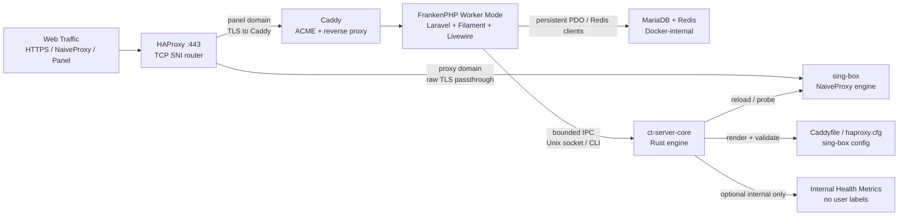

# Cool Tunnel Server / Panel

[](./LICENSE)
[](./LTSC-HENG-LICENSE-DRAFT.md)
[](https://github.com/coo1white/cool-tunnel-server/releases)
[](https://github.com/coo1white/cool-tunnel-server/actions/workflows/ci.yml)
[](https://github.com/coo1white/cool-tunnel-server/actions/workflows/audit.yml)

Cool Tunnel Server is the VPS-side control plane and proxy ballast for
[Cool Tunnel](https://github.com/coo1white/cool-tunnel). It is built for
a 1 vCPU / 1 GB RAM Debian host and treats low memory as a hard design
constraint, not an afterthought.

This repository is not a hosted VPN business. It is a self-operated
server stack: FilamentPHP for management, FrankenPHP worker-mode for the
application runtime, Rust for deterministic core operations, and Docker
for reproducible orchestration.

Read [Disclaimer.md](./Disclaimer.md) before deployment. You are
responsible for local law, provider terms, and the traffic you route.

## System Contract

| Constraint | Position |
| --- | --- |
| Minimum host | Debian 11/12/13, root SSH, 1 vCPU, 1 GB RAM, ports `80/tcp` and `443/tcp`. |
| Current baseline | `v0.0.77`. Wire format is WireV1; subscription manifests are stable across the 0.0.6x–0.0.7x line. |
| Runtime model | FrankenPHP worker-mode with Laravel Octane. Laravel boot cost is paid once per worker. |
| Core model | `ct-server-core` Rust binary owns rendering, probes, drift checks, the credential-lock invariant, and a Rule Maker daemon FSM with bounded `BytesMut` frames, typed wire errors, and OTel-style network-turn spans. |
| Data posture | Zero user tracking. Internal health metrics are allowed; user data collection is forbidden. |
| Deployment posture | Idempotent shell bootstrap, Docker Compose, pinned manifests, Makefile gates. |
| License posture | Active license: AGPL-3.0-only. Restrictive LTSC-Heng terms are drafted in [LTSC-HENG-LICENSE-DRAFT.md](./LTSC-HENG-LICENSE-DRAFT.md). |

## Architecture Deep-Dive



FrankenPHP worker-mode keeps the Laravel application resident. The panel
does not cold-boot the framework on every request, and database/Redis
clients are reused through the worker lifetime where the framework and
driver allow it. This reduces request latency, allocator churn, and CPU
spikes during Filament/Livewire interaction.

The Rust core is the deterministic layer. PHP owns operator workflow and
UI state; Rust owns bounded parsing, config rendering, probe execution,
daemon IPC, and drift-sensitive checks. The design goal is zero-copy in
the operational sense: keep data in typed structures, avoid lossy shell
string pipelines, pass only the minimum frame over IPC, and write final
configuration artifacts atomically.

Daemon connections traverse a connection-local finite state machine — the
Rule Maker. Transitions are atomic compare-exchange and the table is the
only code allowed to choose a successor; an event whose required
predecessor does not match forces `HardReset`. Oversized frames, read
timeouts, malformed UTF-8, and malformed JSON are connection-scoped hard
resets. Valid requests whose domain operation fails still return through
`Responding` as a typed wire error. After every successful turn the
server enters `ProbingConstancy`, measures frame and latency pressure
against an 80% bottleneck threshold, and narrows the next read chunk
under load without raising the hard frame cap. See
[docs/daemon-fsm.md](./docs/daemon-fsm.md) and
[docs/observability-dashboard.md](./docs/observability-dashboard.md).

The stack is intentionally split:

| Layer | Implementation | Duty |
| --- | --- | --- |
| Management UI | Laravel 11, Filament 3, Livewire, Blade | Accounts, panel settings, subscription URLs, operator controls. |
| Application runtime | FrankenPHP + Octane worker-mode | Low boot overhead, long-lived workers, bounded recycle via `MAX_REQUESTS=500`. |
| Engine core | Rust workspace under `core/` | Rendering, probes, component checks, reload decisions, typed IPC. |
| Orchestration | Docker Compose, Makefile, shell scripts | Hardening, rebuilds, health checks, backups, release discipline. |

## One-Click Bastion

Fresh Debian VPS as `root`:

```bash
curl -fsSL https://raw.githubusercontent.com/coo1white/cool-tunnel-server/main/scripts/bootstrap.sh | bash
```

Unattended bootstrap with environment prefill:

```bash
DOMAIN=proxy.example.com \
PANEL_DOMAIN=panel.proxy.example.com \
ACME_EMAIL=ops@example.com \
AUTO_INSTALL=1 \
curl -fsSL https://raw.githubusercontent.com/coo1white/cool-tunnel-server/main/scripts/bootstrap.sh | bash
```

The bootstrap path is idempotent. It installs Docker when absent,
fast-forwards the repository under `/opt/cool-tunnel-server`, scaffolds
`.env`, generates strong local secrets, preserves an existing `.env`,
and can chain into `scripts/install.sh` when `AUTO_INSTALL=1`.

The install path performs the heavier alignment work: build images,
embed the Rust core into the panel image, run migrations, render
HAProxy/Caddy/sing-box configuration, verify component pins, and start
the services under Docker Compose hardening.

## Required DNS

Create DNS A records before install:

```bash
proxy.example.com        A    <VPS IPv4>
panel.proxy.example.com  A    <VPS IPv4>
```

Cloudflare records must be **DNS only**. Do not orange-cloud the proxy
or panel hostnames. The SNI router expects direct TCP reachability.

Verify from your workstation:

```bash
dig +short A proxy.example.com
dig +short A panel.proxy.example.com
```

## Industrial Makefile

The Makefile is an operator surface, not decoration. Targets fail early
when required tools, manifests, runtime state, or binary alignment are
wrong. This is the **First Scold** rule: the system rejects an invalid
environment before it mutates production state.

| Command | Role |
| --- | --- |
| `make help` | Enumerate the available operator and developer targets. |
| `make build` | Build the Rust workspace in release mode with offline SQLx metadata. |
| `make deploy` | Alias of `make update`; pull, rebuild, migrate, render, verify, and reload. |
| `make update` | Main production update path. |
| `make audit` | Full local audit gate, equivalent to `make ci`. |
| `make ci` | Rust fmt/clippy/test, PHP syntax, Composer audit, shellcheck, manifest checks, SoT parity, supervisord invariants. |
| `make status` | Docker state, image state, embedded core binary presence, recent panel/sing-box errors, certificate presence. |
| `make components` | Run `ct-server-core component check` against pinned manifests. |
| `make readiness` | Execute `scripts/late-night-comeback.sh`, the 10-check operator launch gate (PASS at `9/10`; structural failures cap the score below the threshold). |
| `make verify-sot-vps` | Validate panel-hostname single-source-of-truth from inside the running Docker stack. |
| `make backup` | Snapshot database, `.env`, and Caddy ACME state. |
| `make sbom` | Generate CycloneDX SBOMs for Cargo, Composer, and Docker surfaces. |

`make update` also runs `ct-server-core guard credential-lock` between
the sing-box render and the post-purge component check. The guard
asserts `db = rendered = manifest = mac-config` for every active proxy
account and fails NG without printing passwords. Operators can invoke
it directly:

```bash
docker compose exec -T panel ct-server-core guard credential-lock
```

Developer gates:

```bash
make fmt
make lint
make test
make php-test
make shellcheck
make manifest-lockstep
```

Production operators should run:

```bash
cd /opt/cool-tunnel-server
make status
make components
make readiness
```

## QA Checklist: Operator's Eyes

### Worker Mode Stability Under Load

- [ ] Confirm FrankenPHP is the active panel runtime:
  `docker compose exec -T panel supervisorctl status frankenphp`.
- [ ] Confirm worker recycle guard is present:
  `docker compose exec -T panel sh -lc 'grep -R "MAX_REQUESTS=500" /etc/supervisor* /etc/supervisord.conf 2>/dev/null || true'`.
- [ ] Drive concurrent panel requests from the VPS or a trusted host:
  `for i in $(seq 1 200); do curl -sk https://panel.proxy.example.com/up >/dev/null & done; wait`.
- [ ] During the run, watch memory and restart behavior:
  `docker stats ct-panel ct-db ct-redis ct-singbox ct-haproxy ct-caddy`.
- [ ] Expected: no panel restart loop, no unbounded memory climb, `/up`
  remains HTTP 200, and `make status` reports no recent fatal panel
  errors.

### Filament UI Responsiveness During Config Changes

- [ ] Open `https://panel.proxy.example.com/admin`.
- [ ] Create, disable, and re-enable a proxy account from Filament.
- [ ] Change an anti-tracking toggle or cover-site setting.
- [ ] In parallel, tail the internal workers:
  `docker compose logs -f --tail=80 panel sing-box haproxy`.
- [ ] Expected: Filament remains responsive, Livewire actions complete,
  the Rust renderer emits deterministic config updates, and sing-box
  reloads without a full-stack restart.

### Docker-Internal Health Metrics Visibility

- [ ] Keep public ports limited to `80/tcp` and `443/tcp`:
  `sudo ss -ltnp`.
- [ ] Confirm no metrics port is host-published:
  `docker compose ps` and `docker inspect ct-panel`.
- [ ] `CT_METRICS_BIND` is opt-in (default empty). The recommended
  single-container value is `127.0.0.1:9292` — bind only inside the
  panel container or loopback namespace, never on a public interface.
- [ ] Scrape from inside the trusted Docker boundary only:
  `docker compose exec -T panel sh -lc 'curl -fsS http://127.0.0.1:9292/metrics || true'`.
- [ ] Expected: internal-health counters only. No usernames, account
  IDs, target hosts, subscription tokens, request IDs, or per-user
  destination data. Network-turn timings appear under
  `otel_network_turn_*` and `ct_threshold_80pct_crossings_total`;
  daemon protocol faults appear under `ct_daemon_fsm_hard_resets_total`.
  The Prometheus scrape config, alert rules, and Grafana panel
  queries live in
  [docs/observability-dashboard.md](./docs/observability-dashboard.md).

## Observability Boundary

Allowed:

- Container health, restart count, memory, CPU, and process limits.
- DB pool pressure, semaphore saturation, reload coalescer counters.
- Component drift checks and version pin verification.
- Synthetic anti-tracking probes initiated by the operator.

Forbidden:

- Per-user destination logs.
- Device identifiers.
- Subscription token logging.
- Request correlation IDs that identify a user.
- Metrics labels such as `username`, `account_id`, `target_host`, or
  equivalent identifiers.

Internal health metrics are an operator safety surface. User data
collection is a posture violation.

## Smoke Tests

Run from `/opt/cool-tunnel-server`:

```bash
docker compose ps
make status
make components
make readiness
```

Verify public routing:

```bash
sudo ss -ltnp | grep ':443'
nc -vz proxy.example.com 443
nc -vz panel.proxy.example.com 443
```

Verify proxy behavior with a real account:

```bash
docker compose exec -T panel sh -lc '
URL=$(php artisan tinker --execute '\''$a = \App\Models\ProxyAccount::where("username", "alice")->firstOrFail(); $d = \App\Models\ServerConfig::current()->domain; echo "https://{$a->username}:{$a->getCleartextPassword()}@{$d}:443";'\'')
ct-server-core probe anti-tracking --via "$URL"
'
```

Expected: JSON with `"reachable":true`.

## Services

| Service | Job |
| --- | --- |
| `haproxy` | Public `:443` TCP SNI router. No TLS termination. |
| `sing-box` | NaiveProxy server for the proxy domain. |
| `caddy` | ACME, certificate renewal, panel-domain reverse proxy. |
| `panel` | FrankenPHP worker-mode Laravel/Filament runtime plus Rust core binary. |
| `db` | MariaDB for configuration and account state. |
| `redis` | Cache, queue, and revocation bus. |

## Project Map

| Path | Purpose |
| --- | --- |
| [docker-compose.yml](./docker-compose.yml) | Production topology, hardening, memory limits, internal networks. |
| [.env.example](./.env.example) | Operator configuration surface. |
| [docker/panel/](./docker/panel/) | FrankenPHP, supervisord, PHP hardening, panel image. |
| [panel/app/Filament/](./panel/app/Filament/) | Filament admin UI. |
| [core/ct-server-core/src/](./core/ct-server-core/src/) | Rust control engine. |
| [core/ct-server-core/src/daemon_fsm.rs](./core/ct-server-core/src/daemon_fsm.rs) | Rule Maker connection FSM, atomic transition table, Heng constancy probe. |
| [core/ct-server-core/src/observability.rs](./core/ct-server-core/src/observability.rs) | OTel-compatible network-turn spans, capped hex dumps, 80% threshold helpers. |
| [core/ct-protocol/src/](./core/ct-protocol/src/) | Shared protocol and manifest structures. |
| [sing-box/config.json.tpl](./sing-box/config.json.tpl) | Proxy engine template. |
| [caddy/Caddyfile.tpl](./caddy/Caddyfile.tpl) | Public Caddy template rendered by the panel/core. |
| [haproxy/haproxy.cfg.tpl](./haproxy/haproxy.cfg.tpl) | Public SNI routing template. |
| [manifests/](./manifests/) | Version pins and component verification rules. |
| [manifests/credential-lock.upstream.json](./manifests/credential-lock.upstream.json) | `db = rendered = manifest = mac-config` invariant for `ct-server-core guard credential-lock`. |
| [scripts/](./scripts/) | Bootstrap, install, update, backup, probes, stress gates. |
| [scripts/late-night-comeback.sh](./scripts/late-night-comeback.sh) | The 10-check operator readiness gate (DNS, ports, ACME, UFW, kernel, NTP, components, Redis bridge, cover invariant, anti-tracking probe). |

## License

The active repository license is **AGPL-3.0-only**. See [LICENSE](./LICENSE).

The LTSC-Heng restrictive license is currently a draft for legal review:
[LTSC-HENG-LICENSE-DRAFT.md](./LTSC-HENG-LICENSE-DRAFT.md).

The draft states the intended stricter posture:

- Software is provided **AS IS**.
- Commercial reselling, white-labeling, paid appliance distribution, or
  managed resale requires Sovereign Endorsement.
- Network-operated modifications must remain source-available in the
  AGPL-3.0 spirit.
- 2026 milestone markers, audit markers, and LTSC provenance comments
  must be retained unless the related behavior is removed and documented.
- User tracking expansion is prohibited.

Bundled upstream components retain their own licenses. See [NOTICE](./NOTICE)
and [THIRD_PARTY_LICENSES.md](./THIRD_PARTY_LICENSES.md).

## Operator References

| Document | Use |
| --- | --- |
| [GETTING_STARTED.md](./GETTING_STARTED.md) | Beginner install path. |
| [docs/installation-debian.md](./docs/installation-debian.md) | Step-by-step Debian 10/11/12/13 install for first-time operators. |
| [docs/operator-runbook.md](./docs/operator-runbook.md) | Update, repair, and incident commands. |
| [docs/architecture.md](./docs/architecture.md) | Deeper system design notes. |
| [docs/components.md](./docs/components.md) | The OK/NG component model and the eleven pinned components. |
| [docs/daemon-fsm.md](./docs/daemon-fsm.md) | Rule Maker text diagram, no-forking rule, Heng constancy logic. |
| [docs/observability-dashboard.md](./docs/observability-dashboard.md) | Prometheus scrape config, alert rules, Grafana panels for `/metrics`. |
| [docs/release-stress-test.md](./docs/release-stress-test.md) | Runtime gate (`scripts/stress/run-all.sh`) for tagging a release. |
| [docs/architectural-decisions-2026.md](./docs/architectural-decisions-2026.md) | Closing record of the 2026 self-audit programme. |
| [docs/cross-platform-clients.md](./docs/cross-platform-clients.md) | Client family roadmap (macOS today, iOS/Android/Windows/Linux planned). |
| [docs/going-to-china.md](./docs/going-to-china.md) | GFW-resistance operator runbook. |
| [docs/ai-unit-test-generation.md](./docs/ai-unit-test-generation.md) | Retrieval anchors and contract-first guidance for AI maintainers. |
| [LTSC.md](./LTSC.md) | Long-term servicing commitments and 2026 milestones. |
| [AUDIT.md](./AUDIT.md) | Audit cycle map and release gates. |
| [SECURITY.md](./SECURITY.md) | Security model and reporting path. |
| [CONTRIBUTING.md](./CONTRIBUTING.md) | Contributor rules and code posture. |

<sub>Jurisdiction: Wyoming, USA. Steward: coolwhite LLC.</sub>
