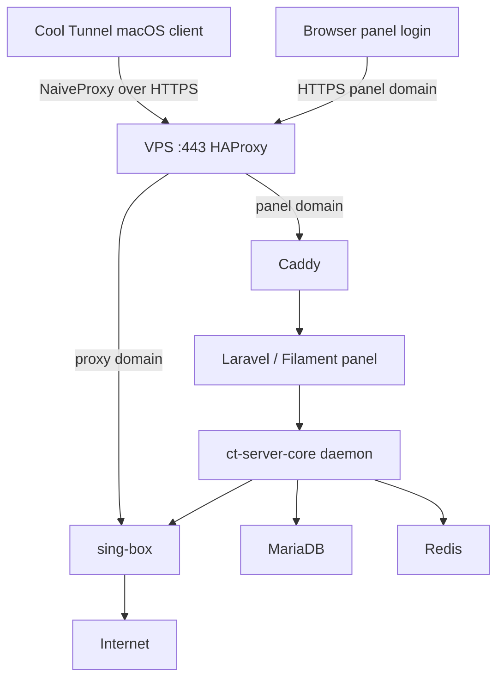

# Cool Tunnel Server

Cool Tunnel Server is the VPS side of
[Cool Tunnel](https://github.com/coo1white/cool-tunnel), a macOS client
for a self-hosted NaiveProxy tunnel.

In plain English:

1. You rent a small VPS.
2. You point a domain at that VPS.
3. This repo installs the server, admin panel, and proxy engine.
4. You create a proxy account in the panel.
5. You paste the subscription URL into the Cool Tunnel macOS app.
6. Your Mac traffic exits from the VPS location.

[](./LICENSE)
[](https://github.com/coo1white/cool-tunnel-server/releases)
[](https://github.com/coo1white/cool-tunnel-server/actions/workflows/ci.yml)
[](https://github.com/coo1white/cool-tunnel-server/actions/workflows/audit.yml)

Read [Disclaimer.md](./Disclaimer.md) before deploying. You are
responsible for the laws, terms of service, and network policies that
apply to your use.

---

## What This Is

Cool Tunnel Server is not a VPN company and not a hosted service. It is
software you run on your own VPS.

It gives you:

| Feature | What it means |
| --- | --- |
| NaiveProxy on `:443` | The client connects over normal-looking HTTPS traffic. |
| Admin panel | Create users, quotas, panel cover sites, and subscription URLs. |
| Subscription URL | A single URL the client imports to fill in server, username, and password. |
| Cover site fallback | Invalid panel/subscription paths return normal-looking HTML. |
| Hot reloads | New or disabled accounts apply without restarting the whole stack. |
| Health checks | Built-in commands tell you if DNS, ports, components, and proxy traffic work. |

The stack is designed for a small VPS. A 1 vCPU / 1 GB RAM Debian box is
enough for a few personal users.

---

## What You Need

Before you start, have these ready:

| Requirement | Example |
| --- | --- |
| Debian VPS with root access | Debian 11, 12, or 13 |
| Domain or subdomain | `cookie.example.com` |
| Panel subdomain | `panel.cookie.example.com` |
| DNS A records | both names point to the VPS IP |
| Open firewall ports | `80/tcp` and `443/tcp` |
| A Mac client | [Cool Tunnel macOS app](https://github.com/coo1white/cool-tunnel) |

If you use Cloudflare, set these DNS records to **DNS only**. Do not use
the orange-cloud proxy for this server.

Quick DNS check from your laptop:

```bash
dig +short A cookie.example.com
dig +short A panel.cookie.example.com
```

Both should print your VPS public IP.

---

## Beginner Quick Start

SSH into the VPS as `root`, then run:

```bash
curl -fsSL https://raw.githubusercontent.com/coo1white/cool-tunnel-server/main/scripts/bootstrap.sh | bash
```

Then edit the environment file:

```bash
cd /opt/cool-tunnel-server
nano .env
```

At minimum, set:

```dotenv
DOMAIN=cookie.example.com
PANEL_DOMAIN=panel.cookie.example.com
ACME_EMAIL=you@example.com
DB_PASSWORD=<random long password>
DB_ROOT_PASSWORD=<different random long password>
REDIS_PASSWORD=<different random long password>
```

Generate random passwords with:

```bash
openssl rand -base64 32
```

Install the stack:

```bash
./scripts/install.sh
```

When it finishes, open:

```text
https://panel.cookie.example.com/admin
```

The first boot can take a few minutes because Docker images are built on
the VPS.

---

## Create Your First Proxy Account

In the admin panel:

1. Open **Proxy accounts**.
2. Click **New**.
3. Enter a username, for example `nick`.
4. Click **Create**.
5. Copy the password shown in the green notification. It is shown once.
6. Click **Subscription URL** for that account.
7. Copy the subscription URL.

Paste that subscription URL into the Cool Tunnel macOS app under
**Import from subscription URL**.

After import, the app should show a profile like:

```text
cookie.example.com:443
```

Start the client in **Global** mode.

---

## Confirm It Works

On your Mac, with Cool Tunnel stopped:

```bash
curl -4 https://ifconfig.co/json
```

Start Cool Tunnel in **Global** mode and run it again:

```bash
curl -4 https://ifconfig.co/json
```

The second result should show the VPS IP and location.

For example:

```json
{
  "ip": "142.171.7.233",
  "country": "United States",
  "region_name": "California",
  "city": "Los Angeles"
}
```

If your goal is YouTube region/location testing, first prove the IP
changed with `ifconfig.co`. Then test YouTube in an incognito/private
browser window, signed out if possible, and deny browser location
permission. YouTube may also use account region, cookies, GPS/browser
location, and history.

---

## Server-Side Smoke Tests

Run these from the VPS in `/opt/cool-tunnel-server`.

Check containers:

```bash
docker compose ps
```

Expected: all main services are `Up` and healthy:

```text
ct-panel
ct-haproxy
ct-singbox
ct-caddy
ct-db
ct-redis
```

Check port 443:

```bash
sudo ss -ltnp | grep ':443'
```

Expected: Docker is publishing `0.0.0.0:443`.

Check components:

```bash
docker compose exec -T panel ct-server-core component check --manifests /srv/manifests
```

Expected: all components show `OK`.

Run the readiness gate:

```bash
LNC_TEST_PROXY_URL='https://nick:<password>@cookie.example.com:443' \
  ./scripts/late-night-comeback.sh
```

Expected: at least 9 of 11 checks pass. DNS, ports, ACME, and firewall
checks are structural. If any of those fail, fix them first.

---

## Debug The Common Failure: Import Works But Proxy Does Not

If the client imports the URL but web traffic does not use the VPS,
debug in this order.

### 1. Is public `:443` reachable?

Run from your laptop:

```bash
nc -vz cookie.example.com 443
nc -vz panel.cookie.example.com 443
```

Both should succeed.

If they fail, check the VPS:

```bash
cd /opt/cool-tunnel-server
docker compose ps
sudo ufw status
sudo ss -ltnp | grep ':443'
```

### 2. Is the server proxy itself working?

Run from the VPS:

```bash
cd /opt/cool-tunnel-server

docker compose exec -T panel sh -lc '
URL=$(php artisan tinker --execute '\''$a = \App\Models\ProxyAccount::where("username", "nick")->firstOrFail(); $d = \App\Models\ServerConfig::current()->domain; echo "https://{$a->username}:{$a->getCleartextPassword()}@{$d}:443";'\'')
ct-server-core probe anti-tracking --via "$URL"
'
```

Expected: JSON with `"reachable":true`.

### 3. Is your Mac actually using the proxy?

On the Mac:

```bash
scutil --proxy
curl -4 https://ifconfig.co/json
```

If `ifconfig.co` does not show the VPS IP, the server is not the
problem. The macOS client or browser is bypassing the system proxy.

### 4. Are you testing the wrong URL?

Do not open this directly in a browser:

```text
https://cookie.example.com
```

That is the proxy endpoint. A normal browser request is not a
NaiveProxy `CONNECT` request, so sing-box may log:

```text
not CONNECT request
```

That log line is normal when someone visits the proxy domain directly.
In the current SNI-router architecture, the public proxy domain is
owned by sing-box, not the Laravel cover-site route.

---

## Updating Later

On the VPS:

```bash
cd /opt/cool-tunnel-server
git pull --ff-only
make update
```

`make update` rebuilds changed images, migrates the database, re-renders
configs, runs component checks, and reloads sing-box.

Useful daily commands:

```bash
make status
make components
make readiness
docker compose logs -f --tail=50 panel
docker compose logs -f --tail=50 haproxy sing-box
```

---

## What Is Running

| Service | Job |
| --- | --- |
| `haproxy` | Public `:443` SNI router. Sends proxy-domain traffic to sing-box and panel-domain traffic to Caddy. |
| `sing-box` | The actual NaiveProxy server. |
| `caddy` | Gets and renews TLS certificates; serves the panel backend. |
| `panel` | Laravel + Filament admin UI and Rust daemon process. |
| `db` | MariaDB for accounts, settings, quotas, and traffic counters. |
| `redis` | Cache, queue, and revocation bus. |

Simple traffic picture:



Deeper architecture notes are in [docs/architecture.md](./docs/architecture.md).

---

## Project Layout For New Coders

If you are learning the codebase, start here:

| Path | What to learn there |
| --- | --- |
| `docker-compose.yml` | Which containers exist and how they connect. |
| `.env.example` | Every operator setting. |
| `panel/app/Filament/` | Admin panel pages and resources. |
| `panel/app/Models/ProxyAccount.php` | Proxy account fields, password storage, subscription URL generation. |
| `panel/app/Http/Controllers/SubscriptionController.php` | What the client downloads from a subscription URL. |
| `core/ct-server-core/src/` | Rust daemon and CLI used by the panel. |
| `core/ct-protocol/src/` | Shared structs for profiles, subscriptions, and components. |
| `sing-box/config.json.tpl` | Template for the proxy engine config. |
| `caddy/Caddyfile.tpl` | Template for certificate and panel routing. |
| `haproxy/haproxy.cfg.tpl` | Public `:443` SNI routing. |
| `manifests/*.upstream.json` | Version pins and component checks. |
| `scripts/` | Install, update, backup, restore, and readiness scripts. |

Recommended reading order:

1. [GETTING_STARTED.md](./GETTING_STARTED.md)
2. [docs/architecture.md](./docs/architecture.md)
3. [docs/components.md](./docs/components.md)
4. [STRUCTURE.md](./STRUCTURE.md)
5. [LTSC.md](./LTSC.md)

---

## Makefile Cheat Sheet

| Command | Use it when |
| --- | --- |
| `make help` | You forgot what commands exist. |
| `make install` | First install after editing `.env`. |
| `make update` | Pull and deploy the latest code. |
| `make status` | Quick look at containers, images, certs, and recent errors. |
| `make components` | Verify bundled binaries and pinned component versions. |
| `make readiness` | Run the 11-point launch checklist. |
| `make ci` | Run the local contributor gate before a PR. |
| `make backup` | Snapshot DB, `.env`, and Caddy ACME state. |

---

## QA Checklist

Use this before you call a deployment done.

### Layer 1: VPS Basics

- [ ] `docker compose ps` shows services up and healthy.
- [ ] `sudo ufw status` allows `80/tcp` and `443/tcp`.
- [ ] `docker compose exec -T panel ct-server-core component check --manifests /srv/manifests` shows OK.

### Layer 2: Panel

- [ ] `https://panel.<domain>/admin` loads.
- [ ] Admin login works.
- [ ] Proxy account creation works.
- [ ] Subscription URL action returns a URL.

### Layer 3: Proxy Engine

- [ ] `ct-server-core probe anti-tracking --via ...` returns `"reachable":true`.
- [ ] `curl -4 https://ifconfig.co/json` on the Mac shows the VPS IP while the client is running.
- [ ] Traffic counters increase in the panel after real usage.

### Layer 4: Cover Site Fallback

- [ ] Bad subscription URLs return the same cover-site shape as other unknown panel paths.
- [ ] Bad subscription URLs do not reveal special errors.

---

## Common Problems

| Symptom | Likely cause | Fix |
| --- | --- | --- |
| Panel does not load | DNS, `PANEL_DOMAIN`, or `:443` issue | Check `dig`, `docker compose ps`, and `sudo ss -ltnp`. |
| Subscription imports, but traffic fails | Proxy endpoint or Mac system proxy issue | Run the debug steps above. |
| `not CONNECT request` in sing-box logs | Someone visited the proxy URL directly | Usually harmless. Test through the client, not a browser. |
| `naiveproxy-client` is NG | Bundled NaiveProxy client cannot run | Run `make update`; then `make components`. |
| ACME/cert fails | Port 80 closed or DNS wrong | Open `80/tcp`; confirm DNS points to the VPS. |
| Docker says network pool overlaps | Local Docker subnet conflict | Change `CT_CLASH_SUBNET` and `CT_CLASH_SINGBOX_IP` in `.env`. |
| Forgot admin password | No email reset is shipped | Run `docker compose exec panel php artisan ct:make-admin --force --email=you@example.com --password=new-password`. |
| Build is killed on 1 GB VPS | Rust build ran out of memory | Add swap or set `CT_CORE_BUILD_PROFILE=release-small`. |

Full troubleshooting:
[docs/installation-debian.md](./docs/installation-debian.md).

---

## License

Cool Tunnel Server is licensed under **AGPL-3.0-only**.

Short version:

- You may use, study, modify, and redistribute it.
- If you run a modified version as a network service, AGPL section 13
  requires you to provide the source for those modifications.
- See [LICENSE](./LICENSE) for the legal text.

Bundled upstream components have their own licenses. See
[NOTICE](./NOTICE) and [THIRD_PARTY_LICENSES.md](./THIRD_PARTY_LICENSES.md).

---

## Community And Support

| Need | Where |
| --- | --- |
| macOS client | [coo1white/cool-tunnel](https://github.com/coo1white/cool-tunnel) |
| installation details | [docs/installation-debian.md](./docs/installation-debian.md) |
| architecture | [docs/architecture.md](./docs/architecture.md) |
| China travel prep | [docs/going-to-china.md](./docs/going-to-china.md) |
| support policy | [SUPPORT.md](./SUPPORT.md) |
| contributing | [CONTRIBUTING.md](./CONTRIBUTING.md) |
| security | [SECURITY.md](./SECURITY.md) |

Commercial deployment, review, and incident support are separate
engagements. Open an issue tagged `enterprise:` if you need that path.

<sub>Jurisdiction: Wyoming, USA. Steward: coolwhite LLC.</sub>
